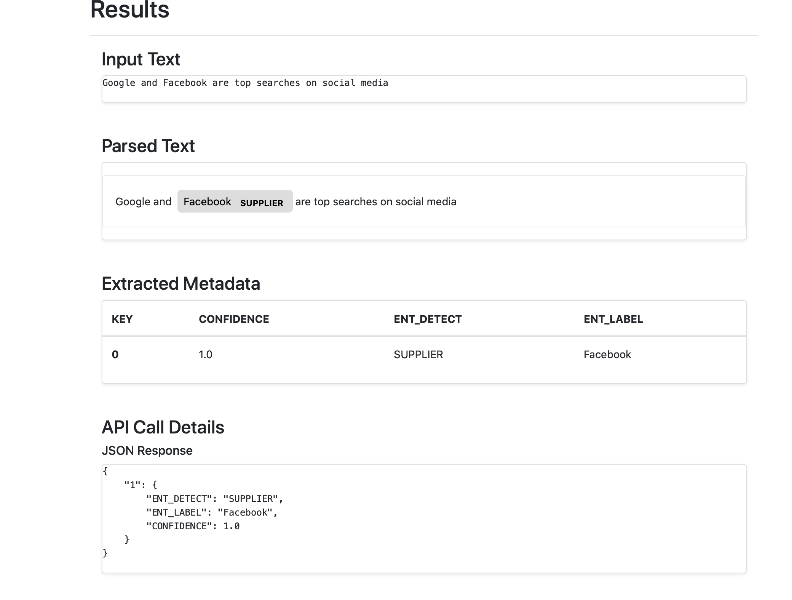

# Entity_Extractor_EC2
deployment of Entity Extractor application on EC2 instance with Docker.

# Results

### Output from raw text




### Output from loaded test text file


# steps to follow

1- start EC2 instance:<br>
```bash

ssh -i flask.pem ubuntu@IP ADDRESS

```

2-Once in instance, add dependencies: <br>


```bash

sudo apt-get update 

```

```bash

docker

```
(to check if we have docker installed)
<br>
3- clone git by:<br>


```bash

git clone (url)

```

4-Install docker using: <br>


```bash

sudo apt-get install docker-compose

OR

sudo apt-get install docker-compose -y

```

5- check again docker image: <br>


```bash

docker <br>

OR

docker-compose 

```

6- Install pip3 : <br>


```bash

sudo apt install python3-pip

```

7- Install unzip command :<br>

```bash
sudo apt install unzip
```

8-Install gnupg2 pass in case of fargate implementation <br>

```bash
sudo apt install gnupg2 pass
```

9- Run requirements.txt : <br>

```bash

pip3 install -r requirements.txt

```

10- Check if all needed dependencies are there<br>

```bash

pip3 freeze

```
11-Check if we have docker images:<br>

```bash

sudo docker images

```
12-Build docker image : <br>


```bash

sudo docker-compose build


```

13-To run this image:<br>

```bash

sudo docker-compose up --build (for building image for 1st time and running at same time)

OR

sudo docker-compose up --build -d (to run docker image and also keep terminal console in function)

OR 

sudo docker-compose up (only for running docker image)

14-check again docker images : <br>

```bash

sudo docker images

```

15- Check current running images by:<br>
```bash
sudo docker ps

```
16-Remember to open ports from "Security Groups":<br>

```bash

port 8000, 80
```

17- Associate Elastic IP

18- Setup SSL certificate into your AWS EC2 instance i.e using https with elastic IP

- ^On a side note, we can use vim editor by using<br>

```bash

sudo vim fliename
```
- ^ for deleting docker image: <br>

https://linuxize.com/post/how-to-remove-docker-images-containers-volumes-and-networks/

19- To Install AWS CLI v2 & configure IAM role

curl "https://awscli.amazonaws.com/awscli-exe-linux-x86_64.zip" -o "awscliv2.zip"


# References

- https://medium.com/boltops/gentle-introduction-to-how-aws-ecs-works-with-example-tutorial-cea3d27ce63d

- https://www.youtube.com/watch?v=2tQ_Yn6O3f4&list=PL5KTLzN85O4K3zhnNPNCgE_Lt-pUsY7YO

- https://linuxize.com/post/how-to-remove-docker-images-containers-volumes-and-networks/

- https://www.youtube.com/watch?v=rNoRB_7pANo&list=PL5KTLzN85O4I4ljDgueVff0UxIKXtzi-8&index=3

- https://stackoverflow.com/questions/40575584/what-is-the-difference-between-amazon-ecs-and-amazon-ec2
